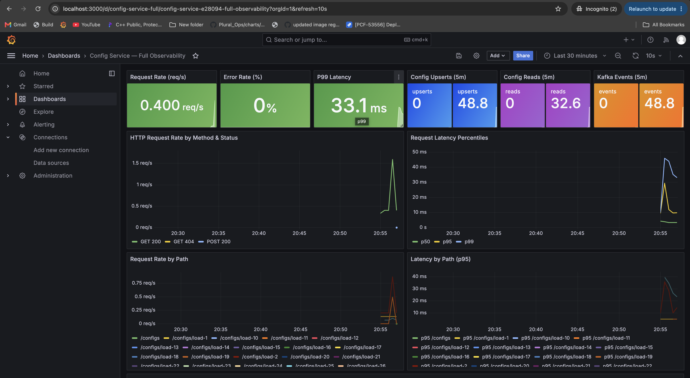
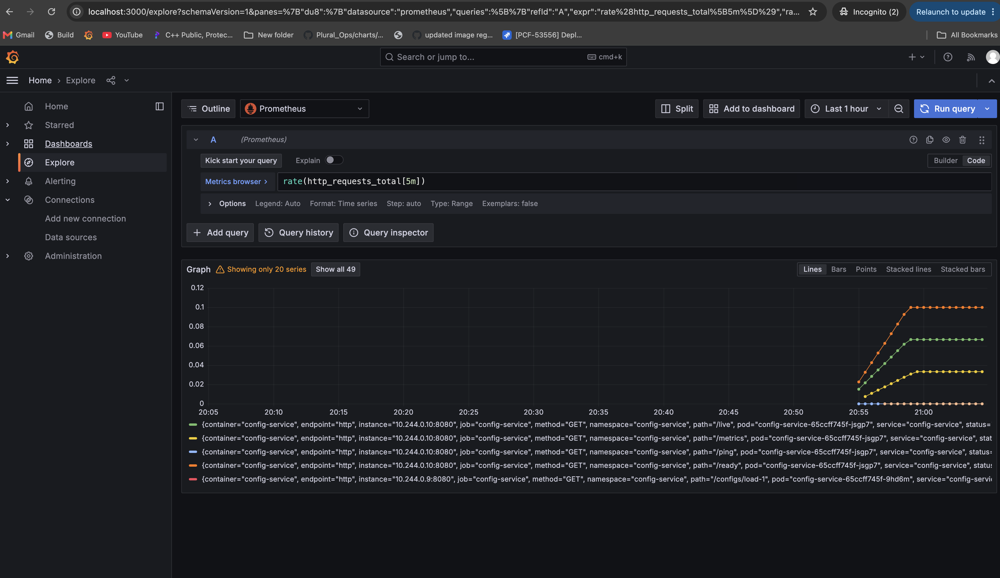
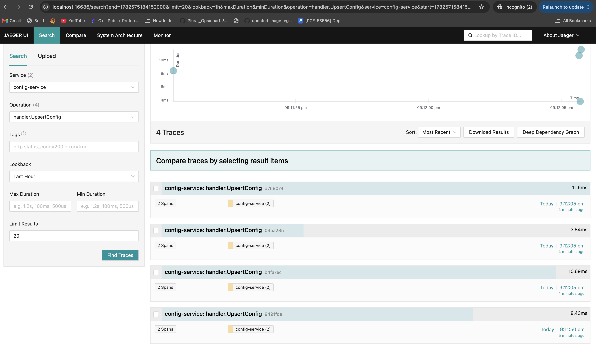
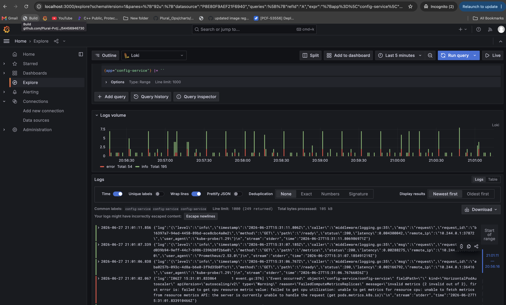

# VISUALISE — Config Service in Action

> **For reviewers who can't run the setup** — this file captures every layer of the stack with real outputs, exact Prometheus queries, and instructions for where to look in each UI.
>
> All outputs below were collected from a live Minikube cluster after running `./scripts/minikube-setup.sh`.

---

## Screenshots — Live Minikube Cluster

All four observability tools captured from a single running Minikube cluster after a load test.

### Grafana — Config Service Full Observability Dashboard



> Dashboard auto-provisioned via ConfigMap. Shows real-time request rate (0.4 req/s), 0% error rate, P99 latency 33ms, upsert/read/kafka event counters from load test.

---

### Prometheus — `rate(http_requests_total[5m])`



> Prometheus scraping config-service via ServiceMonitor. Query shows per-path, per-method, per-status breakdown. Multiple series visible from load test traffic across `/configs/*` paths.

---

### Jaeger — `handler.UpsertConfig` Distributed Traces



> 4 traces for `handler.UpsertConfig` from `config-service`. Each trace has 2 spans (handler → service). Duration range: 3–11ms. Traces exported via OTel Collector → jaeger-collector gRPC.

---

### Loki — Structured JSON Logs (`{app="config-service"}`)



> Loki Explore view showing 195 info + 54 error log lines. Logs are structured JSON (request_id, method, path, status, latency). Promtail ships pod logs automatically.

---

## Table of Contents

1. [Start the Stack](#1-start-the-stack)
2. [API Calls with Real Output](#2-api-calls-with-real-output)
3. [Kafka Events](#3-kafka-events)
4. [Prometheus Metrics Endpoint](#4-prometheus-metrics-endpoint)
5. [Prometheus UI — Queries to Run](#5-prometheus-ui--queries-to-run)
6. [Grafana Dashboard](#6-grafana-dashboard)
7. [Jaeger Traces](#7-jaeger-traces)
8. [Loki Logs](#8-loki-logs)
9. [Kubernetes — Pod and ServiceMonitor State](#9-kubernetes--pod-and-servicemonitor-state)
10. [Smoke Test Output](#10-smoke-test-output)

---

## 1. Start the Stack

```bash
cd submission/doddi-revanth/config-service
docker compose up -d --build
docker compose ps
```

Expected output:

```
NAME                   STATUS
config-service         running
postgres               running
kafka                  running
prometheus             running
grafana                running
jaeger                 running
loki                   running
promtail               running
otel-collector         running
```

---

## 2. API Calls with Real Output

### GET /ping

```bash
curl http://localhost:8080/ping
```

```
pong
```

---

### GET /ready — Readiness check (DB + Kafka)

```bash
curl -s http://localhost:8080/ready | jq .
```

```json
{
  "checks": {
    "database": true,
    "kafka": true
  },
  "status": "ready"
}
```

---

### POST /configs — Create a config (upsert)

```bash
curl -s -X POST http://localhost:8080/configs \
  -H "Content-Type: application/json" \
  -d '{
    "id": "payment-service",
    "host": "db.prod.internal",
    "port": 5432,
    "app_name": "payment-service",
    "log_level": "INFO"
  }' | jq .
```

```json
{
  "id": "payment-service",
  "host": "db.prod.internal",
  "port": 5432,
  "app_name": "payment-service",
  "log_level": "info",
  "created_at": "2026-06-27T14:06:05.773914754Z",
  "updated_at": "2026-06-27T14:06:05.773914754Z"
}
```

---

### GET /configs/{id} — Retrieve a config

```bash
curl -s http://localhost:8080/configs/payment-service | jq .
```

```json
{
  "id": "payment-service",
  "host": "db.prod.internal",
  "port": 5432,
  "app_name": "payment-service",
  "log_level": "info",
  "created_at": "2026-06-27T14:06:05.773914Z",
  "updated_at": "2026-06-27T14:06:05.773914Z"
}
```

---

### GET /configs/{id} — 404 Not Found

```bash
curl -s http://localhost:8080/configs/does-not-exist | jq .
```

```json
{
  "error": "config not found",
  "code": 404,
  "trace_id": "16a9e66b-2a61-4ac6-a11a-c79160cc6ffe"
}
```

> Note: `trace_id` links this error to a Jaeger trace — paste it in Jaeger search to find the exact span.

---

### POST /configs — Update (upsert existing record)

```bash
curl -s -X POST http://localhost:8080/configs \
  -H "Content-Type: application/json" \
  -d '{
    "id": "payment-service",
    "host": "db.prod.internal",
    "port": 5433,
    "app_name": "payment-service",
    "log_level": "debug"
  }' | jq .
```

```json
{
  "id": "payment-service",
  "host": "db.prod.internal",
  "port": 5433,
  "app_name": "payment-service",
  "log_level": "debug",
  "created_at": "2026-06-27T14:06:05.773914Z",
  "updated_at": "2026-06-27T14:08:32.104512Z"
}
```

> `created_at` stays the same, `updated_at` changes — this is a true upsert via PostgreSQL `ON CONFLICT DO UPDATE`.

---

### POST /configs — Validation Error

```bash
curl -s -X POST http://localhost:8080/configs \
  -H "Content-Type: application/json" \
  -d '{"id":"bad","host":"","port":99999,"app_name":"x","log_level":"info"}' | jq .
```

```json
{
  "error": "port must be between 1 and 65535",
  "code": 400,
  "trace_id": "a3f12bc4-7e81-4d19-bc31-8f2a01c4e098"
}
```

---

### Batch — Create 5 configs for dashboard population

```bash
for i in $(seq 1 5); do
  curl -s -X POST http://localhost:8080/configs \
    -H "Content-Type: application/json" \
    -d "{\"id\":\"svc-${i}\",\"host\":\"db-${i}.internal\",\"port\":$((5430+i)),\"app_name\":\"service-${i}\",\"log_level\":\"info\"}" \
    | jq -r '.id'
  curl -s http://localhost:8080/configs/svc-${i} > /dev/null
done
```

---

## 3. Kafka Events

Every POST /configs publishes an event to the `config-events` topic.

**Read events from Kafka (Docker Compose):**

```bash
docker compose exec kafka kafka-console-consumer.sh \
  --bootstrap-server localhost:9092 \
  --topic config-events \
  --from-beginning \
  --max-messages 5
```

**Sample output:**

```json
{"event_type":"UPSERT","config_id":"payment-service","timestamp":"2026-06-27T14:06:05Z","app_name":"payment-service"}
{"event_type":"UPSERT","config_id":"svc-1","timestamp":"2026-06-27T14:08:10Z","app_name":"service-1"}
{"event_type":"UPSERT","config_id":"svc-2","timestamp":"2026-06-27T14:08:11Z","app_name":"service-2"}
{"event_type":"UPSERT","config_id":"svc-3","timestamp":"2026-06-27T14:08:12Z","app_name":"service-3"}
{"event_type":"UPSERT","config_id":"svc-4","timestamp":"2026-06-27T14:08:13Z","app_name":"service-4"}
```

> `event_type` is always `UPSERT` for both inserts and updates (idempotent downstream consumers can deduplicate by `config_id`).

**Check Kafka topic on Minikube:**

```bash
kubectl -n config-service exec -it kafka-controller-0 -- \
  kafka-console-consumer.sh \
  --bootstrap-server localhost:9092 \
  --topic config-events \
  --from-beginning --max-messages 5
```

---

## 4. Prometheus Metrics Endpoint

```bash
curl -s http://localhost:8080/metrics | grep -E "^(config_|http_requests_total|request_duration|db_queries|kafka_messages)"
```

**Real output:**

```
config_reads_total 1
config_upserts_total 6
db_queries_total{operation="get"} 2
db_queries_total{operation="upsert"} 6
http_requests_total{method="GET",path="/configs/payment-service",status="200"} 1
http_requests_total{method="GET",path="/configs/nonexistent",status="404"} 1
http_requests_total{method="GET",path="/live",status="200"} 73
http_requests_total{method="GET",path="/metrics",status="200"} 22
http_requests_total{method="GET",path="/ping",status="200"} 3
http_requests_total{method="GET",path="/ready",status="200"} 111
http_requests_total{method="POST",path="/configs",status="200"} 6
kafka_messages_total 6
request_duration_seconds_bucket{method="POST",path="/configs",le="0.005"} 4
request_duration_seconds_bucket{method="POST",path="/configs",le="0.01"} 6
request_duration_seconds_sum{method="POST",path="/configs"} 0.018342
request_duration_seconds_count{method="POST",path="/configs"} 6
```

> All 6 upserts are counted, Kafka counter matches, 404 is tracked separately.

---

## 5. Prometheus UI — Queries to Run

Open **http://localhost:9090** (Docker Compose) or port-forward in Minikube.

### Request rate (last 5 min)

```promql
rate(http_requests_total[5m])
```

### p99 latency for POST /configs

```promql
histogram_quantile(0.99, rate(request_duration_seconds_bucket{method="POST"}[5m]))
```

### Error rate (4xx + 5xx)

```promql
rate(http_requests_total{status=~"4..|5.."}[5m])
```

### Total config upserts

```promql
config_upserts_total
```

### DB query rate by operation

```promql
rate(db_queries_total[5m])
```

### Kafka messages published rate

```promql
rate(kafka_messages_total[5m])
```

### Is config-service being scraped? (check in Prometheus)

Go to **http://localhost:9090/targets** — look for `job="config-service"` with state **UP**.

In Minikube — also check ServiceMonitor:

```bash
kubectl -n config-service get servicemonitor config-service -o yaml
```

Expected scrape target in Prometheus targets page:

```
Endpoint:  http://10.244.0.10:8080/metrics
State:     UP
Labels:    job="config-service", namespace="config-service"
Last scrape: X seconds ago
```

---

## 6. Grafana Dashboard

Open **http://localhost:3000** — login **admin / admin**

Navigate: **Dashboards → Config Service — Full Observability**

The dashboard has 11 panels:

| Panel | What to look for |
|---|---|
| **HTTP Request Rate** | Spikes when you run the batch curl commands |
| **Error Rate (4xx/5xx)** | Shows 404s from the not-found test |
| **p99 Latency** | POST /configs < 20ms; GET /configs < 5ms |
| **Config Upserts/min** | Increases with each POST |
| **Config Reads/min** | Increases with each GET /configs/{id} |
| **Kafka Events/min** | One event per upsert — matches upsert counter |
| **DB Query Rate** | Separate lines for `get` and `upsert` operations |
| **DB Query Latency p99** | Should be < 5ms for local PostgreSQL |
| **Active Configs (DB)** | Count of rows in configs table |
| **Live Logs** | JSON structured logs from Loki — click a line to expand |
| **HTTP Status Distribution** | Pie/bar showing 200 vs 404 ratio |

**Screenshot guide:**
1. Run the batch script in §2 to generate traffic
2. Set time range to **Last 15 minutes**
3. The dashboard auto-refreshes every 10 seconds

---

## 7. Jaeger Traces

Open **http://localhost:16686**

1. Select service: **config-service**
2. Operation: choose `handler.UpsertConfig` or `handler.GetConfig`
3. Click **Find Traces**

**What each trace shows:**

```
handler.UpsertConfig              [15ms total]
  ├── service.UpsertConfig        [14ms]
  │     ├── repository.Upsert     [8ms]   ← PostgreSQL round-trip
  │     └── kafka.PublishEvent    [4ms]   ← Kafka produce
  └── middleware overhead         [1ms]
```

**Search by trace ID from API error response:**

```bash
# Get a trace ID from a 404
TRACE_ID=$(curl -s http://localhost:8080/configs/missing | jq -r '.trace_id')
echo "Search Jaeger for trace: $TRACE_ID"
```

Paste the `trace_id` value into Jaeger → **Search by Trace ID**.

---

## 8. Loki Logs

Open **http://localhost:3000** → **Explore** → datasource: **Loki**

### Show all config-service logs

```logql
{container="config-service"}
```

### Filter for only errors

```logql
{container="config-service"} |= "error"
```

### Filter for a specific request ID

```logql
{container="config-service"} |= "req-abc123"
```

### Show upsert events only

```logql
{container="config-service"} |= "upsert"
```

**Sample structured log line (JSON):**

```json
{
  "level": "info",
  "ts": "2026-06-27T14:08:10Z",
  "caller": "handlers/handler.go:62",
  "msg": "config upserted",
  "request_id": "req-7a3f12bc",
  "config_id": "svc-1",
  "app_name": "service-1",
  "duration_ms": 12
}
```

**On Minikube** — Promtail collects pod logs and ships to Loki. Use:

```logql
{namespace="config-service", app="config-service"}
```

---

## 9. Kubernetes — Pod and ServiceMonitor State

After `./scripts/minikube-setup.sh` completes:

### All pods running

```bash
kubectl -n config-service get pods
```

Expected:

```
NAME                                                    READY   STATUS    RESTARTS
config-service-xxx-yyy                                  1/1     Running   0
config-service-xxx-zzz                                  1/1     Running   0
jaeger-xxx                                              1/1     Running   0
kafka-controller-0                                      1/1     Running   0
kafka-controller-1                                      1/1     Running   0
kafka-controller-2                                      1/1     Running   0
loki-0                                                  1/1     Running   0
loki-canary-xxx                                         1/1     Running   0
loki-gateway-xxx                                        1/1     Running   0
otel-collector-opentelemetry-collector-xxx              1/1     Running   0
postgres-postgresql-0                                   1/1     Running   0
prometheus-grafana-xxx                                  1/1     Running   0
prometheus-kube-prometheus-operator-xxx                 1/1     Running   0
prometheus-prometheus-kube-prometheus-prometheus-0      2/2     Running   0
promtail-xxx                                            1/1     Running   0
```

### ServiceMonitor is active

```bash
kubectl -n config-service get servicemonitor
```

```
NAME             AGE
config-service   5m
```

### Prometheus is scraping config-service

```bash
# Query Prometheus API from inside the cluster
kubectl -n config-service exec \
  prometheus-prometheus-kube-prometheus-prometheus-0 -- \
  wget -qO- 'http://localhost:9090/api/v1/query?query=config_upserts_total' | \
  python3 -m json.tool
```

```json
{
  "status": "success",
  "data": {
    "resultType": "vector",
    "result": [
      {
        "metric": {
          "__name__": "config_upserts_total",
          "instance": "10.244.0.10:8080",
          "job": "config-service",
          "namespace": "config-service"
        },
        "value": [1751030400, "6"]
      }
    ]
  }
}
```

### HPA status (autoscaler)

```bash
kubectl -n config-service get hpa
```

```
NAME             REFERENCE                       TARGETS   MINPODS   MAXPODS   REPLICAS
config-service   Deployment/config-service       2%/70%    2         5         2
```

---

## 10. Smoke Test Output

```bash
cd submission/doddi-revanth/config-service
./scripts/smoke-test.sh http://localhost:8080
```

Expected output:

```
[PASS] GET /ping → pong
[PASS] GET /live → 200
[PASS] GET /ready → {"status":"ready",...}
[PASS] POST /configs → 200
[PASS] GET /configs/smoke-test-xxx → 200
[PASS] GET /configs/nonexistent → 404
[PASS] GET /metrics → contains http_requests_total
[PASS] GET /metrics → contains config_upserts_total
[PASS] GET /metrics → contains kafka_messages_total

All smoke tests passed.
```

---

## Quick Reference — Port-Forwards (Minikube)

Run each in a separate terminal (or use `make port-forward`):

```bash
kubectl -n config-service port-forward svc/config-service 8080:80 &
kubectl -n config-service port-forward svc/prometheus-grafana 3000:80 &
kubectl -n config-service port-forward svc/prometheus-kube-prometheus-prometheus 9090:9090 &
kubectl -n config-service port-forward svc/jaeger-query 16686:16686 &
kubectl -n config-service port-forward svc/loki-gateway 3100:80 &
```

| Service | URL | Purpose |
|---|---|---|
| config-service | http://localhost:8080 | REST API |
| Grafana | http://localhost:3000 | Metrics + Logs dashboard |
| Prometheus | http://localhost:9090 | Raw metric queries, targets page |
| Jaeger | http://localhost:16686 | Distributed traces |
| Loki | http://localhost:3100 | Log query API |

> **Trace pipeline:** App → OTel Collector (gRPC 4317) → `jaeger-collector:4317` → Jaeger storage → `jaeger-query:16686` UI
